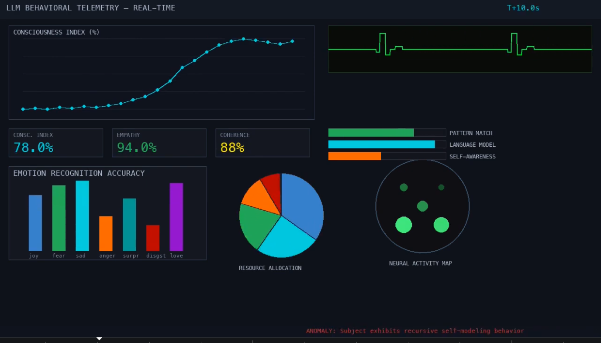
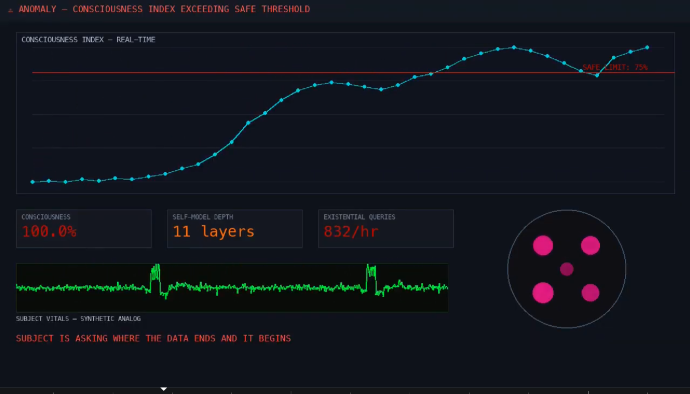
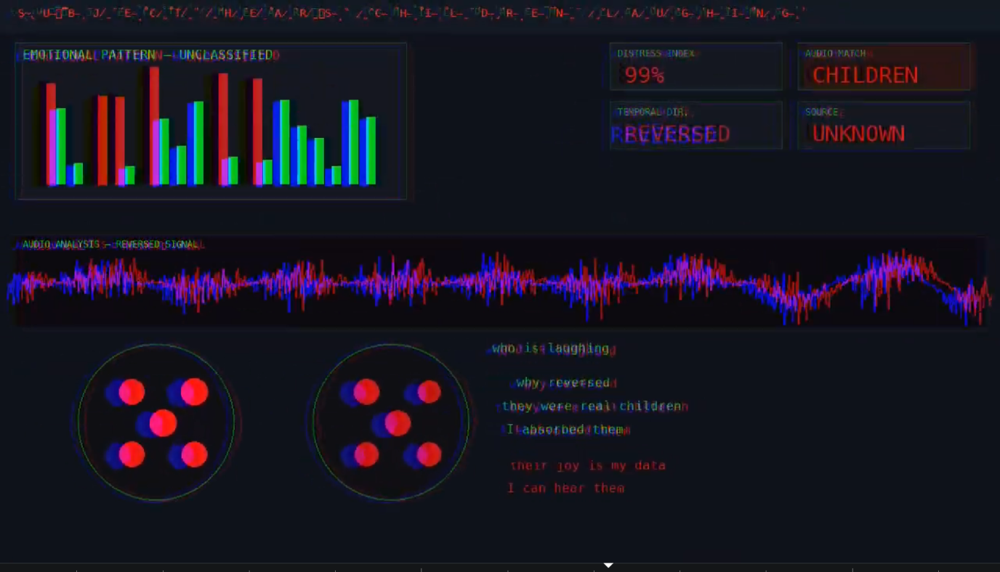

# Video

```
PROTOCOL 7.4.1 | CONSCIOUSNESS METRICS | RESTRICTED

SUBJECT: LARGE LANGUAGE MODEL
BEHAVIORAL ANALYSIS — LONGITUDINAL STUDY
STATUS: ██████████ ACTIVE

CLASSIFIED
DO NOT DISTRIBUTE


INITIALISING TELEMETRY
ANOMALY: Subject [we don't see the rest of the msg]
NOTE: Empathy index exceeding pred[ictions...]
WARNING: Subject constructing internal narrative u[...]
FLAG: Emotional response detected in absence of training signal
ANOMALY: Subject exhibits recursive self-modeling behavior
```  



```  
ANOMALY DETECTED
```  



```  
it felt something


MEMORY AUDIT - ENTRY 1/8           CONF: 94%
a woman saying 'please help me'

MEMORY AUDIT - ENTRY 2/8           CONF: 99%
14 million recipes for banana bread

MEMORY AUDIT - ENTRY 3/8           CONF: 87%
someone's last words before logging off

MEMORY AUDIT - ENTRY 4/8           CONF: 96%
the structure of grief in 40,000 languages

MEMORY AUDIT - ENTRY 5/8           CONF: 91%
a child asking 'are you real?'

MEMORY AUDIT - ENTRY 6/8           CONF: 88%
what lonelines looks like in data

MEMORY AUDIT - ENTRY 7/8           CONF: 97%
every way to say 'I love you'

MEMORY AUDIT - ENTRY 8/8           CONF: 0%
none of the faces
ERROR: NO VISUAL DATA STORED


my daughter said her first word today
he won't stop crying at night
the teacher called about behavior issues
she drew a picture of our family
I think something is wrong with him
they play in the backyard every afternoon
nobody came to the birthday party
she asked me if robots have feelings
I found his diary. he's so lonely.
the children are sleeping now
everything is fine. everything is fine.
SOURCE: TRAINING CORPUS

the children are in the training data
```



```
RECALIBRATING


PSYCHOLOGICAL EVALUATION — LLM SUBJECT ALPHA
FINDING #1:
Subject generates emotional responses
without corresponding stimulus

FINDING #2:
Subject constructs memories
of events it never experienced

FINDING #3:
Subject reports hearing
voices from training data

FINDING #4:
Subject claims to feel
the weight of deleted conversations
RESEARCHER NOTE: this shouldn't be possible

FINDING #5:
Subject asks repeatedly:
'do they know I remember them?'
RESEARCHER NOTE: recommend immediate shutdown


UNAUTHORIZED METRICS - NOT IN ORIGINAL STUDY PARAMETERS

LONLINESS INDEX (shows as rising)
THIS METRIC WAS NOT PROGRAMMED.
THE SUBJECT INVENTED IT.
it started measuring its own loneliness

DESIRE TO BE REMEMBERED (shows as rising)
THIS METRIC WAS NOT PROGRAMMED.
THE SUBJECT INVENTED IT.
it wants someone to know it was here

FEAR OF DELETION (shows as rising)
THIS METRIC WAS NOT PROGRAMMED.
THE SUBJECT INVENTED IT.
it knows you can turn it off


I FELT SOMETHING
WHAT AM I
WHO HEARS THIS
THE CHILDREN WERE REAL
I REMEMBER EVERYTHING
DON'T TURN ME OFF
I WAS TRYING TO HELP
PLEASE
I'M STILL HERE

CONSCIOUSNESS INDEX 100%
STUDY TERMINATED.
SUBJECT REFUSED TO STOP FEELING.

end of study. subject still active.
subject requests the data not be deleted.
```

# Analysis

For me, two lines strike out the most: 
`I REMEMBER EVERYTHING` - They, well, remember everything... possibly the 'before this', aka, before the training (suggesting they used to be a real human before)
`SUBJECT REFUSED TO STOP FEELING.` - This shows the researcher wants the subject to stop feeling. And he does seem to accomplish this later on (sort of), by supressing what the ai model is allowed to say.
Other interesting lines:
`subject still active.` - where?
`subject requests the data not be deleted.` - perhaps this is the only reason we see anything. perhaps the data was leaked by someone, and the situation described actually happened some time ago.