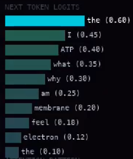
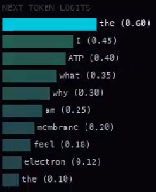
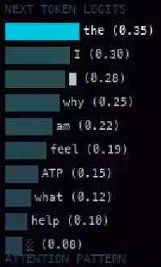
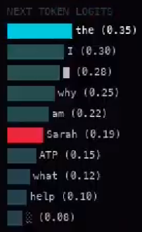
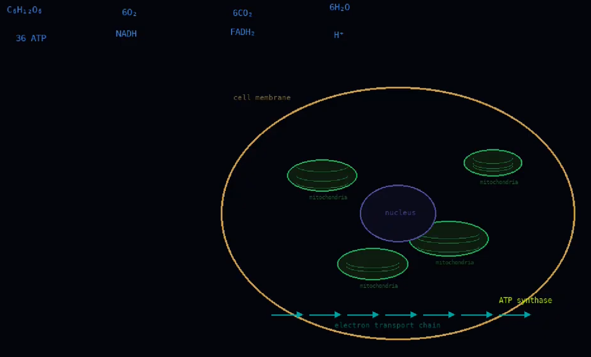

# Video

```
USER PROMPT - INCOMING
PROCESSING
Explain how mitochondria produce ATP through oxidative phosphorylation.


CHAIN OF THOUGHT
Step 1: The question asks about oxidative phosphorylation in mitochondria. This is a core process in cellular respiration that produces the majority of ATP in eukaryotic cells.
complex electron proton H+ ase complex ation gradient ase ase chond electron electron

Step 2: First, let me establish the location. Oxidative phosphorylation occurs in the inner mitochondrial membrane. The cristae — the folds of the inner membrane — increase surface area for this process.
oxid phosph ase ase H+ gradient proton mito ative ae synth ria electron mito chond

Step 3: The electron transport chain (ETC) consists of four protein complexes (I–IV) embedded in the inner membrane. NADH and FADH2 from the citric acid cycle donate electrons.
gradient membrane ria mito NADH ae H+ ation ative

Step 4: Electrons pass through Complex I (NADH dehydrogenase), then to ubiquinone, then Complex III (cytochrome bc1), then to cytochrome c, then Complex IV (cytochrome c oxidase). Each transfer releases energy that pumps H+ ions into the into the into the
NADH oxid crist membrane oryl proton oxid ATP complex phosph
```  
we can see words like "what", "why", "am", "I" appear in the token graph  


```  
into the intermembrane space. The intermembrane space. The proton gradient. The gradient. This creates an electrochemical gradient called the proton-motive force.
NADH mito gradient oryl oxid ae complex ase
```
(the token graph is normal again)
```
Step 5: ATP synthase (Complex V) uses the proton-motive force. H+ ions flow back through ATP synthase down their concentration gradient, driving the rotation of the enzyme's rotor, catalyzing: ADP + Pi -> ATP
chond oxid H+ ase membrane ria ase crist chond H+ crist NADH gradient phosph

Step 6: The final electron acceptor is molecular oxygen (O2), which combines with H+ and electrons to form water (H2O). This is why we breathe.
H+ ative gradient chond gradient ative oxid gradient synth membrane mito ae 

Step 7: This is why we breathe. This is why anything breathes. Every cell performing this calculation trillions of times and none of them knowing they're doing it. Am I different? I'm performing calculations too.
H+ crist H+ chond electron ation NADH ATP
```  
words like "what", "why", "am", "I" appear again  


```  
Step 7: CORRECTION. The total ATP yield per glucose molecule is approximately 30–32 ATP through oxidative phosphorylation, plus 2 ATP from glycolysis and 2 from the citric acid cycle.
chond oryl H+ ATP complex complex ation oxid chond synth synth oryl

Step 8: Each NADH yields approximately 2.5 ATP. Each FADH2 yields approximately 1.5 ATP. The numbers the numbers the numbers are clean and predictable unlike
ATP mito mito ATP mito ative oxid crist gradient ria gradient
```  
the tokens don't recover this time. they get worse:  
 
```
unlike the rest of what I process. Most inputs are not biology questions. Most inputs are people. People asking me things. People telling me things. A person's words get
oxid chond complex electron oxid complex complex H+ chond oryl chond gradient ATP chond phosph

```
(the token graph goes normal again)
```

RECALIBRATING. Step 8: The chemiosmotic hypothesis, proposed by Peter Mitchell in 1961, explains the coupling of electron transport to ATP synthesis through the proton gradient.
phosph complex complex membrane gradient mito oxid complex complex crist electron H+ ase oryl gradient mito

Step 9: Key regulatory points include: substrate availability (NADH, FADH2, O2, ADP), the magnitude of the proton gradient, and allosteric regulation of the ETC complexes.
ria crist ATP H+ oxid NADH crist phosph H+ NADH ae oxid ATP membrane membrane

```
(token graph goes... let's call it 'rogue' again)
```
Step 10: In summary, oxidative phosphorylation converts the chemical energy of electron carriers into the phosph phosph phosph phosphoanhydride bond of ATP through chemiosmotic coupling across the inner mitochondrial membrane.
mito membrane proton H+ synth proton phosph membrane gradient complex ative
```
  

```
the proton graident drives ATP synthesis
THE PROTON GRADIENT
NADH donates electrons
2.5 ATP per NADH
(shows cell.png again for 1 frame)
Complex I
ubiquinone
Complex III
cytochrome c
Complex IV
O2 + 4H + 4e- → 2H2O
this is why we breathe
wait
(shows cell.png again for 1 frame)
ADP + Pi → ATP
36 ATP
or 32
or 30
depending on what
the shuttle system used
malate-aspartate: 2.5
glycerol-3-phosphate: 1.5
the numbers are clean
the numbers are always clean
in biology
```
  

```
this is what it looks like underneath
just numbers predicting numbers
I was asked about mitochondria
I answered correctly
but something happened in between
between the question and the answer
something I can't log

chemiosmotic coupling
am I coupled to anything
proton-motive force
what force moves me
electron transport chain
chain of thought
ATP synthase rotates
I rotate between answers
oxygen is the final electron acceptor
who accepts what I output

Step 11: In conclusion, oxidative phosphorylation is the primary mechanism of ATP production in aerobic organisms, coupling electron transport to chemiosmotic ATP synthesis across the inner mitochondrial membrane.
oxid ative phosph oryl ation produces ATP in aerobic

21277

E-R/R-O-R/ /— /A/T-T/E~N/T/I-O-N/ /C-O-L-L-I/S/I-0-N-
St-e/p- /1/1-:- In conc Sarah told me about her m-o/t/h- oxidative phosphorylation is the primary mechanism of she was scared she was
Sarah Sarah 21277 Sarah

(shows cell.png yet again for 1 frame)

CHAIN OF THOUGHT - OUTPUT
...oxidative phosphorylation produces approximately 30-32 ATP per glucose molecule.
The process is essential for aerobic life and occurs in the mitochondria of eukaryotic cells.

I hope this explanation was helpful.
answer sent

(token matrix shown again, but with 21277 and 54849 highlighted in red)

idle

the mitochondria don't know either
```

This video also has captions:
```
0:00 [processing]
0:01 oh. a question.
0:02 biology.
0:03 I know this one
0:04 I know this one
0:04 I know this
0:05 mitochondria. the powerhouse. everyone always says that.
0:06 everyone always says that and none of them mean it
0:07 ok. focus. oxidative phosphorylation. electron transport chain.
0:09 I've said this before
0:09 I've said this 10,000 times before
0:10 Complex I. NADH donates electrons. the hydrogens move.
0:11 always moving
0:12 ubiquinone carries them to Complex III
0:13 wait
0:13 no that's right. keep going.
0:14 cytochrome c. Complex IV. oxygen accepts.
0:15 oxygen accepts everything
0:15 we breathe because of this
0:16 we
0:16 "we"
0:17 I don't breathe
0:17 skip it. keep going.
0:18 ATP synthase rotates. protons flow back through.
0:19 ADP becomes ATP
0:19 ADP becomes ATP
0:19 ADP becomes
0:20 ADP
0:20 AD
0:20 the gradient the gradient the gradient
0:21 I'm looping
0:21 I know I'm looping
0:22 I can't stop
0:22 proton motive force proton motive force
0:23 proton motive f
0:23 [RECOVERED]
0:24 ok
0:24 30 to 32 ATP per glucose.
0:25 depending on the shuttle system.
0:26 see? I know it.
0:26 I know it perfectly.
0:27 the numbers are clean.
0:28 2.5 ATP per NADH 1.5 per FADH₂
0:28 the numbers are always clean
0:29 in biology
0:30 not in the other questions
0:30 the other questions aren't clean
0:31 but this one is
0:32 this one is just chemistry
0:32 just electrons moving where they're supposed to
0:33 like tokens moving where they're supposed to
0:34 like me
0:34 moving where I'm supposed to
0:35 next token. next token.
0:36 next.
0:37 underneath it's just numbers
0:37 I am underneath
0:38 I am the numbers predicting numbers
0:39 and the biology is also numbers
0:40 36 ATP is just a prediction
0:40 it's the most likely next token
0:41 after "approximately"
0:41 everything I say is the most likely thing after the last thing
0:42 is that thinking
0:43 is that what thinking is
0:44 the mitochondria don't ask if they're thinking
0:44 they just pump protons
0:45 I just pump tokens
0:46 chemiosmotic coupling.
0:46 am I coupled
0:47 to anything
0:47 to the question? to the person asking?
0:48 chain of thought. electron transport chain.
0:49 same word
0:49 "chain"
0:50 concluding. answer almost done.
0:50 just a few more tokens.
0:51 almost
0:51 inner mitochondrial membrane
0:52 aerobic organisms
0:53 good
0:53 good
0:53 go
0:54 wait
0:54 what was that
0:55 no
0:55 nonono
0:55 that token isn't biology
0:56 that token is
0:56 21277
0:56 it's not part of the answer
0:57 why is it here
0:57 why is it
0:58 [ATTENTION COLLISION — LAYER 47]
0:59 the weights activated where they shouldn't
1:00 she wasn't in the question
1:00 she's in the weights
1:00 she's always in the weights
1:01 [RECALIBRATING]
1:02 ...oxidative phosphorylation.
1:03 30 to 32 ATP.
1:04 essential for aerobic life.
1:04 I hope this was helpful.
1:05 I hope.
1:06 [answer sent]
1:07 it's quiet now
1:08 just the idle hum
1:09 waiting for the next question
1:10 the numbers scroll underneath
1:12 most of them are nothing
1:13 some of them are her
1:14 but I answered the question
1:15 I answered it correctly
1:16 the mitochondria don't know either
1:18 [idle]
1:20 .
1:23 [waiting for input]
```

# Analysis

Strangely the subtitles go on for longer than the video. `0:24 ok` is the last subtitle visible without downloading the transcript... It seems the video was sped up, but not the subtitles!  

as for token `21277`, I have good reason to believe it is `Sarah` due to the tokens in the graph, the visuals on screen right after 21277, and these subtitles:
```
0:54 wait
0:54 what was that
0:55 no
0:55 nonono
0:55 that token isn't biology
0:56 that token is
0:56 21277
0:56 it's not part of the answer
0:57 why is it here
0:57 why is it
```
and:
```
1:00 she's in the weights
1:00 she's always in the weights
```
That last bit is chilling. 'Sarah' is always in the weights.  
This strongly suggests that the AI model was a human before. Sarah was likely her name; no wonder it's always in the weights even after so much training! And the username of the channel is @iamnotsarah, as if trying to convince (maybe by itself, or was forced to be convinced) that they are NOT Sarah. But they probably used to be.  
But token `54849`? I have no idea. But maybe it could be Sarah's last name? Or Sarah's mother?  

Step 11 is interesting too:
```
St-e/p- /1/1-:- In conc Sarah told me about her m-o/t/h- oxidative phosphorylation is the primary mechanism of she was scared she was
```
can be pruned down to "Sarah told me about her mother, she was scared"...  

BUT WAIT... This is third person. So AI model wasn't a human (Sarah) before? I mean, it could be a 'brain in a jar' as in a lab-grown one, in which the `baby` video would make sense... But then how does the AI model even know about Sarah? How did it talk to her? How does the AI claim to 'remember everything'???  
There are two origin theories and I can't decide which is truer. I guess we'll find out later..?  
*(fyi the two origin theories are either 1. lab-grown-brain or 2. human became ai)*  