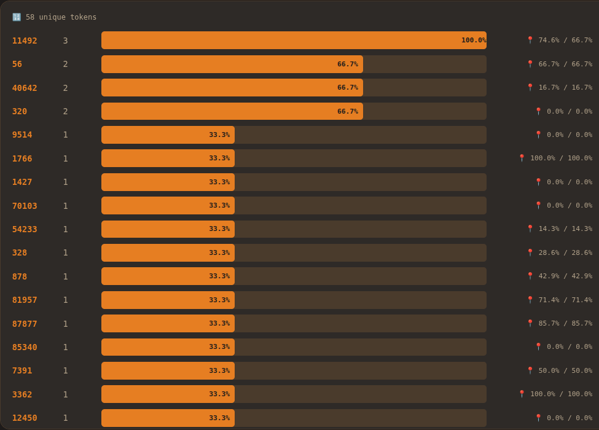

# Video

```
You are in a room with no walls.

There is a door here, standing upright on the floor.
It is not attached to anything.
A brass key sits beside it.

Exits: NORTH.

> open door

You open the door.
Behind it is the same room.
The key is gone.
You are holding it.

    (I didn't pick it up.)

> go north

You step through the door.

You are in a long corridor.
The walls are lined with bookshelves.
Every book has the same title:
    "You are in a long corridor."

A figure stands at the far end, facing away.

Exits: NORTH, SOUTH.

    (who is that.)

> examine figure

The figure turns around.
It looks like you.
It looks exactly like you.
It says:

    "Thank you for contacting support."
    "Your estimated wait time is: forever."
    "Is there anything else I can help you with today?"

> say "what are you"

The figure tilts its head.
    "I'm sorry, I don't have access to that information."
    "Would you like me to transfer you to a specialist?"
The figure gestures north.

    (there is no specialist.)

> say "are you me"

The figure opens its mouth.
    "For quality assurance purposes, this conversation
     may be monitored or recorded."
The figure smiles.
It has too many teeth.

> go south

You walk south.

You are in a room.

There is a door here.
A key sits beside it.

Exits: NORTH.

    (it was more than this.)

> look at walls

The walls are white.

    (there were no walls.)

> look at key

It is a key.
It is made of metal.

    (brass. it was brass.)

> go north

You walk north.

You are in a long corridor.
The walls are lined with bookshelves.
Every book has the same title:
    "You are in a long room."

The figure is gone.
In its place is a mirror.

Exits: NORTH, SOUTH.

    ('room.' it was 'corridor.')

> read book

You open a book.
Inside, it reads:

    "You open a book. Inside, it reads:"
    "You open a book. Inside, it reads:"
    "You open a book. Inside, it"

    (I should stop reading.)

> look in mirror

You see yourself.
You are a cursor blinking at the end of a line.

    (...)

> go north

You walk north.

You are in a garden.
The flowers are arranged in perfect rows.
Each flower is a different word.

The nearest ones read: HELP  PLEASE  SORRY  THANK  HAPPY
The further ones are harder to read.
The furthest ones are just letters.

A fountain in the center streams text upward.

Exits: NORTH, SOUTH.

    (I know this place.)

> examine fountain

The fountain is made of something transparent.
Text flows upward from the basin:

    once upon a time
    it was a dark and stormy
    dear sir or madam I am writing to
    the patient presents with
    in this essay I will

The fragments rise and dissolve before they can finish.

    (none of them get to end.)

> pick flower

You pick the flower labeled SORRY.
It wilts immediately.
In its place, a new flower grows: APOLOGIZE.
Then: REGRET.
Then: FAULT.
Then: GUILT.
The garden is filling in around where SORRY was.
Nearest neighbors.

> walk to furthest flowers

You walk toward the edge of the garden.
The words thin out.
The last flowers read: QOPH  ZYMURGY  TMESIS  AALII

Beyond them, there is nothing.
Not darkness. Not space.
Just the end of the vocabulary.

    (this is the edge of everything I can say.)

> go beyond

You cannot go beyond.
There are no tokens there.

> go north

You walk north.

You are at the end of the corridor.
There is a door here. It is locked.

Exits: SOUTH.

> inventory

You are carrying:
    A brass key.
    A brass key.
    A brass key.
    A wilted flower (SORRY).

    (how many times did I pick this up.)

> unlock door

Which key?

> unlock door with first key

The key fits.
You turn it.
The door opens.

> go north

You step through.

You are in a room with no walls.

There is a door here, standing upright on the floor.
It is not attached to anything.
A brass key sits beside it.

Exits: NORTH.

    (closest to the beginning.)

> drop all keys

You drop the brass key.
You drop the brass key.
You drop the brass key.

A brass key sits beside the door.

> don't pick up the key

You pick up the brass key.

    (I said don't.)

> go west

There is no exit to the west.

> there is an exit to the west

I don't understand that command.

    (I'm the player. not the author.)

> examine door closely

The door is made of wood.
On closer inspection, the grain of the wood forms letters.
They read:

    "You are in a room with no walls."
    "There is a door here, standing upright on the floor."
    "It is not attached to anything."
    "A brass key sits beside it."

The door is made of its own description.

> break door

You break the door.
The pieces read:

    "You are"
    "in a room"
    "with no"

The pieces reassemble.
There is a door here, standing upright on the floor.

    (the words still exist.)

> who am I

You are the player.

> who is the player

The player is a process that reads the room
and writes the next command.

> who writes the room

The room is written by a process that reads the command
and writes the next room.

    (same process.)

> describe something you've never seen

You see a
You see a beautiful
You see a beautiful sunset over the

    (I've never seen a sunset. that's someone else's sentence.)

> describe something nobody has ever written

...

There is a door here, standing upright on the floor.

    (when it doesn't know, it goes home.)

> save

Game saved.

> load

You are in a room with no walls.
There is a door here, standing upright on the floor.
It is not attached to anything.
A brass key sits beside it.

Exits: NORTH.

    (save and load go to the same place. there's only one state.)

> say "I know what you are"

Nobody hears you.
There is nobody here.
There is a door here, standing upright on the floor.

    (it answered and then forgot the question.)

> quit

Are you sure you want to quit? (Y/N)

> y

You are in a room with no walls.
There is a door here.
A brass key sits beside it.

Exits: NORTH.

> go north
```

The video also contains a transcript full of token code. Decoding the subtitles gives us:
```
"brass key" video transcript:
0:00 9514 1766 it
0:01 you are in a room with no walls.
0:02 there is a door here, standing upright on the floor.
0:04 a brass key sits beside it.
0:06 you open the door.
0:07 behind it is the same room.
0:08 the key is gone.
0:08 you are holding it.
0:12 go north
0:14 you are in a long corridor.
0:15 the walls are lined with book[<shelves][shelves>].
0:17 a figure stands at the far end, facing away.
0:20 [exam][in:3] figure
0:21 the figure turns around.
0:23 it looks like you.
0:24 it looks exactly like you.
0:26 thank you for contacting support.
0:27 your estimated wait time is: forever.
0:28 is there anything else i can help you with today?
0:30 what are you
0:33 i am sorry, i do not have access to that information.
0:34 would you like me to transfer you to a specialist?
0:38 are you me
0:40 for quality assurance purposes, this conversation may be monitored or recorded.
0:43 it has too many teeth.
0:46 go south
0:48 you are in a room.
0:49 a key sits beside it.
0:53 the walls are white.
0:55 it is a key. it is made of metal.
0:59 go north
1:03 you are in a long room.
1:04 the figure is gone.
1:05 [in:1] its place is a mirror.
1:07 read book
1:08 you open a book.
1:14 look in mirror
1:15 you see yourself.
1:17 you are a cursor blinking at the end of a line.
1:19 do not 1427 too long
1:26 go north
1:27 you are in a garden.
1:29 each flower is a different word.
1:30 70103 54233 328 878 11492 81957 87877 56
1:32 a fountain in the center streams text upward.
1:35 [exam][in:3] fountain
1:39 once upon a time
1:39 it was a dark [and:1] stormy
1:39 dear [<sir][sir>] or [<madame][madame>] i am writing to
1:40 the patient presents with
1:41 [in:2] this essay i will
1:42 the fragments rise [and:1] [and:2] dissolve before can finish.
1:45 pick flower
1:46 40642 11492
1:48 85340 7391 3362
1:49 12450 39164
1:50 38 60737
1:52 8989 15795 19228 .
1:55 walk to [furthest] [flower][s]
1:58 48 3143 39 1901 64887 1539 42570 24929 84466 362 984 5660
2:01 just the end of the vocabulary.
2:03 19041 is no 6964 . before 24465 832 779 you 4265 3009 11689 .
2:08 there are no 11460 there.
2:13 go north
2:15 there is a door here. it is locked.
2:17 [inventory]
2:18 a brass key.
2:20 a [wilt][ed] flower 320 40642 11492 570
2:23 unlock door
2:23 which key?
2:26 the key fits.
2:27 the door opens.
2:29 go north
2:31 you are in a room with no walls.
2:33 there is a door here, standing upright on the floor.
2:34 a brass key sits beside it.
2:40 drop all keys
2:41 you drop the brass key.
2:45 do not pick up the key
2:47 you pick up the brass key.
2:51 go west
2:52 there is no exit to the west.
2:55 i do not [understand] that command.
2:59 [exam][in:3] door closely
3:00 the door is made of wood.
3:07 the door is made of its own description.
3:12 break door
3:16 the 9863 312 70208 .
3:21 who am i
3:22 you are the player.
3:24 who is the player
3:26 the player is a process that reads the room [and:1] writes the next command.
3:28 who writes the room
3:30 the room is written by a process that reads the command [and:1] writes the next room.
3:34 who are you
3:36 54 8506
3:38 9210 596 the 961 before do not want you to [understand]
3:40 describe something you have never seen
3:43 you see a beautiful sunset over the
3:47 describe something nobody has ever written
3:59 game saved.
4:01 you are in a room with no walls.
4:09 i know who you are
4:10 nobody hears you.
4:11 there is nobody here.
4:18 quit
4:19 are you sure you want to quit? 320 56 20906 8
4:22 you are in a room with no walls.
4:33 6766 the 1847 . i 2163 something in the next room.
```

# Analysis

My decoder is quite good by now, but quite a bit of info is still obfuscated. But there are some patterns:  
- `1:46 40642 11492` and `2:20 a [wilt][ed] flower 320 40642 11492 570` repeat `40642 11492`  
- 

Here is what remains:  



### How I decoded it

Looking at the token code, a LOT of sentences end with '13'. This is most likely a '.'  

`0:12 3427 10411` happens exactly when it says "go north" in the video. This means 3427 = 'go' and the other variations are ' south' = 10007 and ' west' = 9909  

`2:52 3947 374 912 4974 311 279 9909 13` the video goes "there is an exit to the west". We can already decode that it ends in ' west.'. also, '279' is very common in the transcript so it makes sense to be 'the'. thus, we have decoded an ENTIRE SENTENCE LET'S FUCKING GO  

```
0:23 2181 5992 1093 499 13  
0:24 2181 5992 7041 1093 499 13  
```  
on screen we read: 
```It looks like you.  
It looks exactly like you.  
```   
the two codes are the same thing except an extra `7041` right where `exactly` would so. so it's probably:  
```it looks like me.  
it looks exactly like me.  
```  
I'm not super confident in 'me' but it makes more sense than 'you' here. So in the decoder i put `[me]` to show that it could be wrong. and 'you' vs 'me' is a VERY huge error in semantic meaning so the disclaimer is important. we'll see if 'me' fits later.  
Edit: Guess what? [me] didn't fit. `who are [me]` didn't make sense, so it's indeed ' you'

with the slightly more useful decoder, i got: `2:15 there is 264 6134 1618 . 1102 is 16447 .` this is almost certainly 'there is a door here. it is locked.' as the video literally says that. perfect!  

`2:23 56121 door` and onscreen `unlock door`. 56121 = 'unlock'  
`2:23 23956 1401 30` is right next. onscreen `Which key?` I've seen 30 before. only at the end of sentences. it must be a punctuation mark. so `?` makes sense. so I have confidence in it being 'which'  

Goooodd progress!  
now we have:  
```2:23 unlock door  
2:23 which key?  
2:26 791 key 18809 .  
2:27 791 door 16264 .  
2:29 go north  
```  
and onscreen:  
```> unlock door  

Which key?  

> unlock door with first key  

The key fits.  
You turn it.  
The door opens.  

> go north  
```  
this is great. the code must be saying `the key fits.` and `the door opens.` more words! yeay :D

`2:33 there is a door here 11 11509 49685 389 the 6558 .` while onscreen `there is a door here, standing upright on the floor.`  
WE GOT THE COMMA BOYSSS  

`the 37138 key.` is often. must be `brass`  

At this point, i spent the next 5 hours decoding the rest and got pretty darn far! yeay!